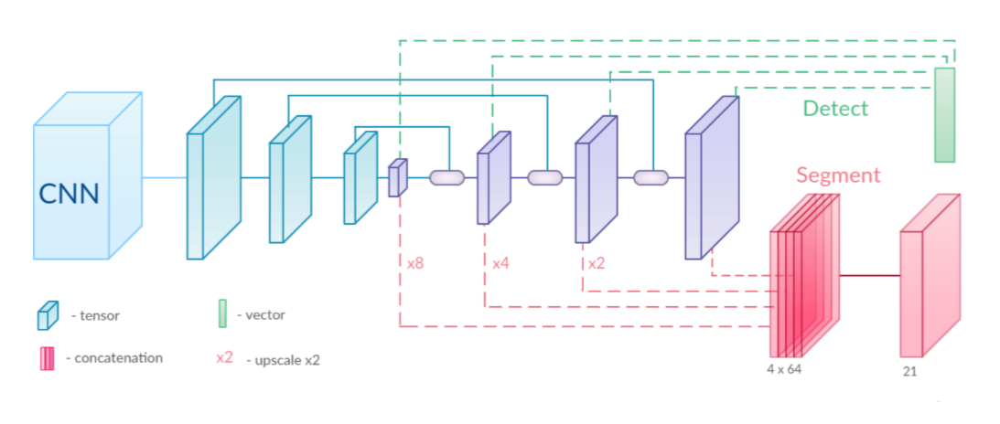
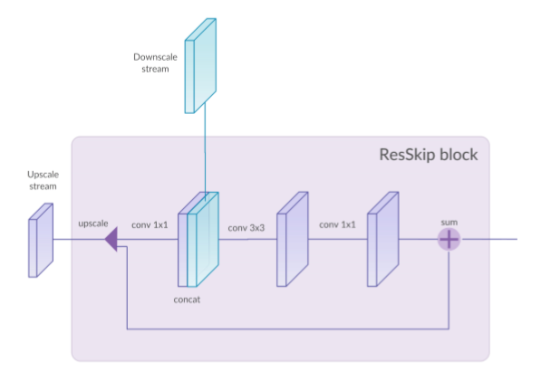

### BlitzNet: A Real-Time Deep Network for Scene Understanding

### Introduction
`Object detection` and `semantic segmentation` are two fundamental problems for `scene understanding` in `computer vision`.  
`对象检测`和`语义分割`是`计算机视觉`中`场景理解`的两个基本问题。

* Good segmentation is sufficient to perform detection in some cases.

* Correctly identified detections are also useful for segmentation.

* The goal of this paper is to solve efficiently both problems at the same time, 
by exploiting image data annotated at the `global object level`, at the `pixel level`, or at `both levels`.
    * 论文旨在同时高效的解决`对象检测`和`语义分割`这两个问题

* `BlitzNet` is able to provide accurate `segmentation and object bounding boxes` in real time.
    * `BlitzNet` 可以实时的提供精确的`分割和对象边界框`

### Related Work

* Object detection
    * R-CNN
    * R-FCN
    * SSD
    * YOLO

* Semantic segmentation and deconvolutional layers

* Joint semantic segmentation and object detection
    * UberNet

* This work is inspired by these previous attempts, but goes a step further in integrating the two tasks, 
with a `fully convolutional` approach where `network weights are shared for both tasks until the last layer`,
which has advantages in terms of `speed`, `feature sharing`, and `simplicity for training`.

### Scene Understanding with BlitzNet

* Global VIew of the Pipeline

    1. The input image is first processed by a `convolutional neural network` to 
    produce a `map that carries high-level features`. Use the network ResNet-50 as feature encoder.
    
    2. The resolution of the feature map is iteratively reduced to perform 
    a multi-scale search of bounding boxes, following the SSD approach.
    
    3. The feature maps are then `up-scaled` via `deconvolutional layers` 
    in order to subsequently `predict precise segmentation maps`. 
    A variant of DSSD with a simpler `deconvolution module`, called `ResSkip`, involves `residual` and `skip connections`.
    
    4. `Prediction` is achieved by `single convolutional layers`, 
    one for `detection`, and one for `segmentation`, in one forward pass.
    
    
    
    * The BlitzNet architecture, which performs `object detection` and `segmentation` with `one fully convolutional network`. 
        1. On the left,`CNN denotes a feature extractor, here ResNet-50`;
        2. it is followed by `the downscale-stream` (in blue) and 
        3. the last part of the net is `the upscale-stream` (in purple), which 
        `consists of a sequence of deconvolution layers interleaved with ResSkip blocks` (see Figure 3). 
        4. The `localization and classification of bounding boxes` (top) and `pixel-wise segmentation` (bottom) 
        are performed in a `multi-scale fashion` by `single convolutional layers` operating on the output of `deconvolution layers`.

* SSD and Downscale Stream

* Deconvolution Layers and ResSkip Blocks

    * Use `skip connections` that `combines feature maps` from `the downscale and upscale streams`, call `ResSkip`.
    
    * `Incoming feature maps` are `upsampled` to the size of corresponding skip connection via `bilinear interpolation`.
    
    * Then both `skip connection feature maps` and `upsampled maps` are `concatenated` and `passed through a block` and 
    `summed` with the `upsampled input` through a `residual connection`.
    
    

* Multi-scale Detection and Segmentation

    * In pipeline, most of the weights are shared.

* Speeding up Non-Maximum Suppression
    
    * There are too many proposals, so suggest a different post-processing strategy to accelerate detection.
    * Non-Maximum suppression may become the bottleneck at inference time.
    
* Training and Loss Functions
    
    * Given labeled training data where each data point is annotated with `segmentation maps`, 
    or `bounding boxes`, or with `both`, we consider a loss function which is simply 
    `the sum of two loss functions of the two task`.
    
    * For segmentation, the loss is the cross-entropy between predicted and target class distribution of pixels.

    * For detection, performing tiling of the input image with anchor boxes and matching them to ground truth bounding boxes. 
    
    *  We use the same data augmentation suggested in the original SSD pipeline, 
    namely photometric distortions, random crops, horizontal flips and zoom-out operation.
        * 光度失真、随机剪切、水平翻转、缩放操作。

### Experiments

* Datasets and Metrics
    * 介绍了`COCO`、`VOC07`、`VOC12`和`VOC12增强版`数据集
    * 介绍了评估方法
    
* Experimental Setup

    * Optimization Setup
        * Adam algorithm
        * mini-batch size of 32 images
        * initial learning rate is 0.0001 and decreased twice during training by a factor 10
        * weight decay parameter of 0.0005
    
    * Modeling setup
        * use ResNet-50 as a feature extractor
        * 512 feature maps for each layer in down-scale and up-scale streams
        * 64 channels for intermediate representations in the segmentation branches
        * BlitzNet300 take input images of size 300 x 300
        * BlitzNet512 take input images of size 512 x 512
        * Different versions of the network vary in the stride of the last layer of the up-scaling-stream.

### Conclusion

* introduce a `joint approach` for `object detection` and `semantic segmentation`.

* by using a `single fully convolutional network` to `slove both problems` at the same time.

* learning is facilitated by `weight sharing` between the two tasks, and inference is performed `in real time`.

* show that the `two tasks benefit from each other`.

