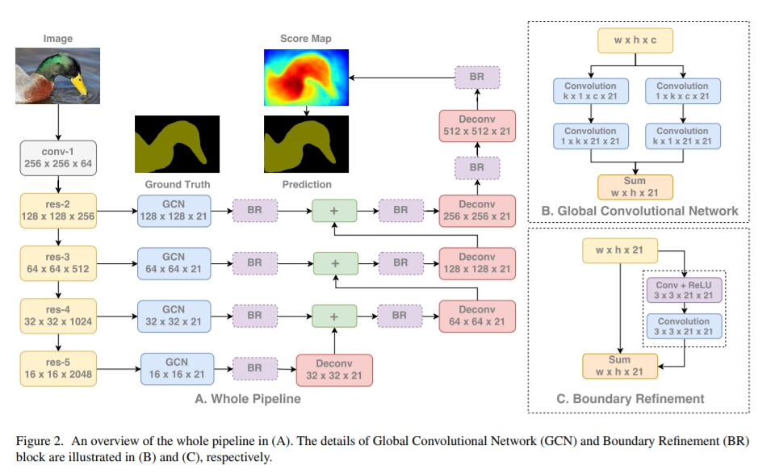

### Large Kernel Matters

### Abstract
1. 在同样计算复杂度下，在整个网络中“堆叠小的卷积核”是设计网络架构的一个趋势，
因为“堆叠小的卷积核”比“大的卷积核”更加高效。   
2. 在“密集的像素级预测”的语义分割中同时进行“分类(classification)”
和“定位(localization)”任务时，“大的卷积核”有非常重要的作用。
3. 根据我们的设计原则，建议用Global Convolutional Network来解决语义分割中的
“分类(classification)”和“定位(localization)”问题，
也建议一个基于残差的边界细化进一步细化物体边界。

### Introduction
1. 语义分割可以看成时每一个像素的分类问题，即像素级分类。在这个问题中有两个任务：
classification和localization。一个设计良好的模型应该能同时解决这两个任务。
2. 分类和定位是两个矛盾的任务:
    * 对于分类任务，需要模型有转换不变性，例如翻转、旋转等。
    * 对于定位任务，模型应该对转换敏感，例如对于每个语义类别的精确像素位置。
3. 卷积语义分割模型主要关注定位问题，因此就降低了分类性能。
4. 在论文中，我们推荐GCN(Global Convolutional Network, GCN)来同时处理这两个任务。
5. 这里有两个设计原则：
    * 从定位角度来说，在结构上应该用全卷积(fully convolutional)，
    而不用fully-connected or global pooling layers，这些层会丢失位置信息。
    * 从分类角度来说，在结构上应该采用较大的核，使特征和像素分类器之间进行密集连接，
    从而增强不同变换的能力。
6. 具体实践
    * 使用FCN风格的结构作为基本的框架
    * 使用GCN生成semantic score maps
    * 采用对称的、分离的大型filter(symmetric, separable large filters)来降低模型的参数和计算复杂度
    * 采用基于“残差结构的边界细化(boundary refinement, BR)”模块对边界进行定位
7. 贡献
    * we propose Global Convolutional Network for semantic segmentation which explicitly 
    address the "classification" and "localization" problems simultaneously.
        * 提出用于语义分割的Global Convolutional Network，可以同时解决分类和定位问题
    * Boundary Refinement block is introduced which can further improve 
    the localization performance near the object boundaries.
        * 提出边界细化模块(Boundary Refinement block)，可以进一步的提升物体边界的定位能力

