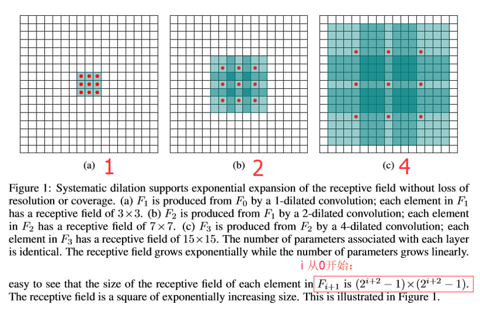
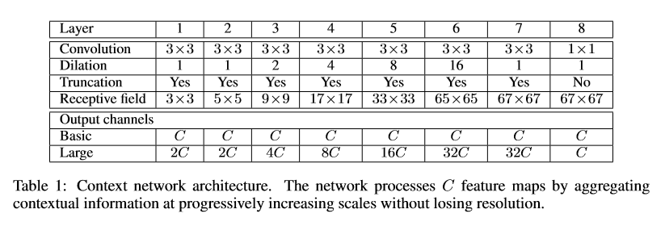
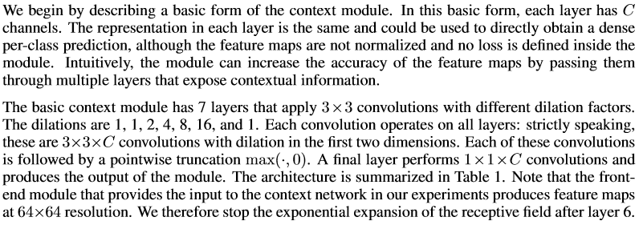

### Multi Scale Context Aggregation by Dilated Convolutions
* [代码实现](https://github.com/alisure-ml/FCN-DilatedConvolution)

### Abstract
* Dense prediction problems such as semantic segmentation
are structurally different from image classification.
* Dilated Convolution module uses dilated convolutions to systematically
aggregate multi-scale contextual information without losing resolution.
    * 使用膨胀卷积收集多尺度上下文信息且没有分辨率损失。
* The architecture is based on the fact that dilated convolutions support
exponential expansion of the receptive field without loss of resolution or coverage.
    * 膨胀卷积支持以指数级扩增感受野且没有分辨率损失或者覆盖。
* The receptive field grows exponentially while the number of parameters grows linearly.
    * 感受野指数级增长，参数数量线性增长。
    

### Introduction

### Dilated Convolutions
* 从传统卷积的定义到膨胀卷积的定义：传统卷积是膨胀卷积的特例
* 膨胀卷积的发展历史
* 计算感受野的大小:  
    

### Multi-scale context aggregation (Context module)
* The context module is designed to increase the performance of dense prediction 
architectures by aggregating multi-scale contextual information. 
* The module takes C feature maps as input and produces C feature maps as output. 
The input and output have the same form, thus the module can be plugged into existing 
dense prediction architectures.
    * 模块的输入是C个特征图，输出也是C个特征图。输入和输出的形式相同，因此可以插入到架构中。
* The module can increase the accuracy of the feature maps by passing them 
through multiple layers that expose contextual information.
    * 通过模块提取上下文信息可以提高准确率。   
   

* 膨胀卷积的初始化问题。

### Front end
* Adapted the VGG-16 network for dense prediction and removed the last two pooling and striding layers.
    * 采用VGG-16网络，移除最后的池化层
*  The front-end module takes padded images as input and produces feature maps 
at resolution 64×64. We use reflection padding: the buffer zone is filled by reflecting 
the image about each edge.
    * 前端模块产生64×64的特征图，采用映射padding.
* Convolutions in all subsequent layers were dilated by a factor of 2 for each pooling layer that
was ablated. Thus convolutions in the final layers, which follow both ablated pooling layers,
are dilated by a factor of 4.
    * 通过因子为2的膨胀卷积消除“去掉池化层对分辨率”的影响。最后一层卷积的膨胀因子为4.
* Author found that simplifying the network by removing the pooling layers made it more accurate.
Author also remove the padding of the intermediate feature maps.

# Experiments
* Use all images in MSCOCO with at least one object from the VOC-2012 categories.
Annotated objects from other categories were treated as background.
* Training was performed in two stages:
    * In the first stage, trained on VOC-2012 images and MSCOCO images together.
        * Training was performed by SGD with mini-batch size 14 and momentum 0.9.
            * SGD优化，批次大小为14，动量为0.9
        * 100K iterations were performed with a learning rate of 0.001 and
        40K subsequent iterations were performed with a learning rate of 0.0001.
            * 前10万步的学习率为0.001，后4万步的学习率为0.0001.
    * In the second stage, fine-tuned the network on VOC-2012 images only.
        * Fine-tuning was performed for 50K iterations with a learning rate of 0.00001.
            * 5万步进行微调，学习率为0.00001.

* Three stages:
    * Front-End
    * Context module
    * Joint Front-End and Context module

### Reference
* [Multi Scale Context Aggregation by Dilated Convolutions](paper/Multi-Scale%20Context%20Aggregation%20by%20Dilated%20Convolutions.pdf)

