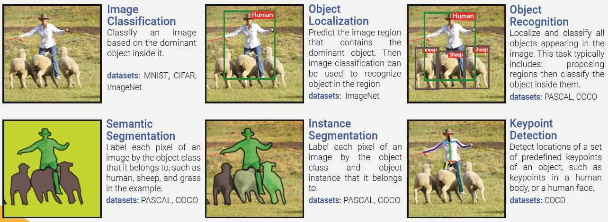

## A Review on Deep Learning Techniques Applied to Semantic Segmentation

### TODO
* [History Of Object Recognition](paper/HistoryOfObjectRecognition.pdf)
    * 过年回家详细阅读里面的内容

### 路线
> 图像语义分割是一个从粗略到精细的过程

* 图像分类(Image Classification,图像中一个或多个实例分类)
* 对象定位(Object Localization)
* 对象识别(Object Recognition)
* 图像语义分割(Semantic Segmentation)
* 实例分割(Instance Segmentation,同一类中不同的实例分割)
* 关键点检测(Keypoint Detection)

### FCN问题
* 缺少对不同特征的感知，阻碍了再具体问题和场景中的应用
* 由于固有的空间不变性，不能将全局的上下文信息考虑进去
* 不能感知实例
* 不能适应无结构的数据
* 需要大量的标签数据

### 两个方面
* 像素级别的精度，即怎样处理局部信息
* 目标级别的分割，即怎样整合全局信息

### FCN改进方向
- 解码变种：对低分辨率的特征图的处理不同   
  * 编码器：卷积网络
  * 解码器：反卷积网络

- 整合上下文信息：整合不同空间尺度的信息，对局部信息和全局信息进行平衡   
  * 条件随机场：做为后期处理，组合低层次的像素级别的信息
  * 膨胀卷积：膨胀卷积核获得更大的感受野（带孔卷积）
  * 多尺度聚合：金字塔系列，将图像resize到多个尺度分别分割，最后整合分割结果
  * 特征融合：提取不同层的特征进行融合，包含了不同的局部上下文信息
  * 递归神经网络：

### 上下文信息
众所周知，图像语义分割需要获取`上下文信息`帮助提高准确率。
* `不使用空洞卷积的传统卷积`通过`下采样（pooling）`来增大感受野，以此获取上下文信息。
    * 卷积核的大小不变
    * 减少了数据量
    * 有利于防止过拟合
    * 但是损失了分辨率，丢失了一些信息
    
* `空洞卷积`通过`膨胀卷积核`来增大感受野，以此获取上下文信息。
    * 参数个数没有增加
    * 数据量没有减少
    * 分辨率没有损失
    * 但是计算量增大，内存消耗增大

### Reference
* [A Review on Deep Learning Techniques Applied to Semantic Segmentation](paper/A%20Review%20on%20Deep%20Learning%20Techniques%20Applied%20to%20Semantic%20Segmentation.pdf)
    * [A Review on Deep Learning Techniques Applied to Semantic Segmentation](https://arxiv.org/pdf/1704.06857.pdf)
    * [深度学习图像分割的常用方法](http://blog.csdn.net/gqixf/article/details/78030203)

* [语义分割与深度学习全指南2017（译）](https://zhuanlan.zhihu.com/p/27806801)
    * [A 2017 Guide to Semantic Segmentation with Deep Learning](http://blog.qure.ai/notes/semantic-segmentation-deep-learning-review)

