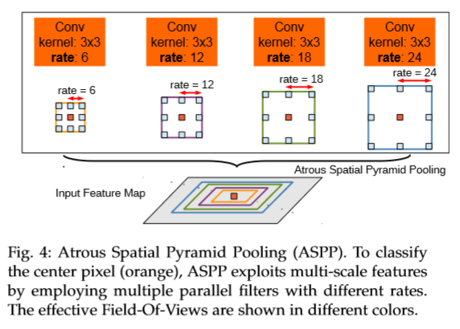
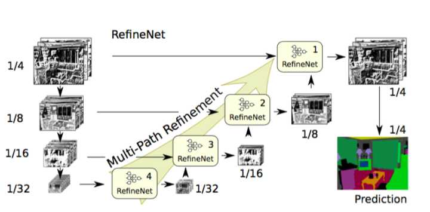
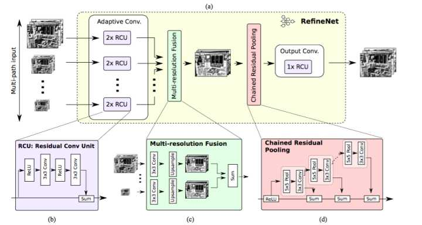
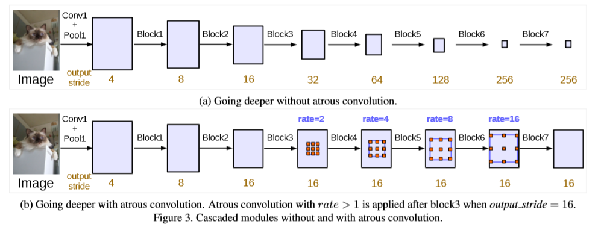

### A 2017 Guide to Semantic Segmentation with Deep Learning
* [语义分割与深度学习全指南2017（译）](https://zhuanlan.zhihu.com/p/27806801)
* [Revolutionizing healthcare with deep learning](http://blog.qure.ai/notes/semantic-segmentation-deep-learning-review)

### 语义分割
> 语义分割指“像素级的图像理解”，对图像中的“每个像素标注所属的类别”。
  Not only recognizing each object,but also have to delineate the boundaries of each object.

* 数据集：VOC and COCO are the most important datasets for semantic segmentation.
    * [VOC2012](http://host.robots.ox.ac.uk/pascal/VOC/voc2012/)
    * [MSCOCO](http://cocodataset.org/)

### 语义分割的方法
* 深度学习之前    
    * Texton Forest
    * Random Forest based classifiers

* 深度学习早期
    * Patch classification
        * 图像块分类：利用像素周围的图像块对每一个像素进行分类。
        > Main reason to use patches was that classification networks usually 
        have full connected layers and therefore required fixed size images.

* FCN时代
    * FCN [Fully Convolutional Networks for Semantic Segmentation](https://arxiv.org/pdf/1411.4038.pdf)
        * Popularized CNN architectures for dense predictions without any fully connected layers.
            * FCN是一个非常流行的没有“全连接层”的“密集的像素级分类”的“CNN架构”。
        * This allowed segmentation maps to be generated for image of any size and 
        was also much faster compared to the patch classification approach.
            * 由于不需要全连接层，可以对“任意大小的图像”进行“语义分割”，且比“图像块分类”方法快很多。
        
    * FCN问题
        * Pooling layer
            * Pooling layers increase the field of view and 
            are able to aggregate the context while discarding the 'where information'.
                * CNN中的池化层能够扩大感受野，可以通过丢弃位置信息来聚合上下文信息。
            * Semantic segmentation requires the exact alignment of class maps and 
            needs the 'where information' to be preserved.
                * 语义分割要求分割结果精确，因此需要保留位置信息。
            
    * FCN架构  
        > 解决FCN问题的两种架构
        1. Encoder-Decoder架构
            * Encoder gradually reduces the spatial dimension with pooling layers and 
            decoder gradually recovers the object details and spatial dimension.
                * 编码器通过“池化层”逐渐“减少空间维度”，解码器逐渐“恢复物体的细节和空间维度”。
            * There are usually shortcut connections from encoder to decoder 
            to help decoder recover the object details better.
                * 为了使解码器有更好的物体细节，通常会有“从编码器到解码器的shortcut连接”。
            
            * 代表模型
                * [U-Net](https://arxiv.org/pdf/1505.04597.pdf)
                * [SegNet/DeconvNet](https://github.com/alisure-ml/SegNet)
                * [RefineNet](https://github.com/alisure-ml/RefineNet)
        
        2. Dilated/Atrous convolutions结构
            * Use dilated or atrous convolutions and do away with pooling layers.
                * 使用空洞/带孔卷积代替池化层。
            * TODO: more info
                * more info
                
            * 代表模型或文章
                * [PSPNet](https://github.com/alisure-ml/PSPNet)
                * [DeepLab](https://github.com/alisure-ml/FCN-Review)
                * [Rethinking Atrous Convolution for Semantic Image Segmentation](https://arxiv.org/pdf/1706.05587.pdf)
                
* FCN后端
    * 条件随机场 Conditional Random Field(CRF)
        * Conditional Random Field(CRF) postprocessing are usually used to improve the segmentation.
            * 通常CRF被用于后处理以改进分割结果（表示怀疑）。
        * CRFs are graphical models which smooth segmentation based on the underlying image intensities.
            * CRFs是一种基于“底层图像的像素强度”进行“平滑分割”的“图模型”。
        * Similar intensity pixels tend to be labeled as the same class.
            * 原理：相似强度的像素趋向于标记为同一类别。
    
    * 后端代表
        * DenseCRF:[全连接CRF](http://liangchiehchen.com/projects/DeepLab.html) [论文](https://arxiv.org/pdf/1412.7062.pdf)
        * CRFasRNN:[Conditional Random Fields as Recurrent Neural Network](https://github.com/alisure-ml/CRFasRNN)

### 语义分割网络代表及架构

1. FCN [Fully Convolutional Networks for Semantic Segmentation](https://arxiv.org/pdf/1411.4038.pdf)
    * 主要贡献
        1. 在语义分割任务中推广了端到端的卷积网络。
        2. 修改ImageNet预训练模型并应用到图像语义分割中。
        3. 采用解卷积实现上采样。
        4. 通过引入跳跃连接改善上采样的粒度。
    
    * 作者将分类网络模型中的“全连接层卷积化”之后，由于CNNs中含有池化操作，
    所以需要通过“上采样”操作将特征图还原成输入大小。由于池化操作造成了信息损失，
    上采样只能生成粗略的分割结果，所以从高分辨率的特征图中引入“跳跃连接”改善上采样的精度。
    
    * 上采样方式
        1. 双线性插值:bilinear interpolation
        2. 解卷积:deconvolutional layers
        3. 上卷积:upconvolution
        4. 完全卷积:full convolution
        5. 转置卷积:transposed convolution
        6. 小数步长卷积（微步卷积）:fractionally-strided convolution
    
    
    
        
2. SegNet [A Deep Convolutional Encoder-Decoder Architecture for Image Segmentation](https://arxiv.org/pdf/1511.00561.pdf)
    * 主要贡献
        1. 将最大池化索引（Maxpooling indices）转换到解码器，提高了分割分辨率
        
    * FCN网路中使用了解卷积层和少量的跳跃连接，但输出的分割图比较粗糙，SegNet引入了更多的跳跃连接。
    SegNet没有使用FCN中编码器产生的特征图，而是使用了最大池化层的索引。
    
    
    
    
3. Dilated Convolutions [Multi-Scale Context Aggregation by Dilated Convolutions](https://arxiv.org/pdf/1511.07122.pdf)
    * 主要贡献
        1. 将VGG网络修改为含空洞卷积的`前端模块（frontend module）`
        2. [计算输出shape和感受野大小](https://github.com/alisure-ml/FCN-Review/blob/master/Multi_Scale_Context_Aggregation_by_Dilated_Convolutions.md#%E8%AE%A1%E7%AE%97%E8%BE%93%E5%87%BAshape%E5%92%8C%E6%84%9F%E5%8F%97%E9%87%8E%E5%A4%A7%E5%B0%8F)
        3. 提出`上下文模块（context module）`，用于空洞卷积的多尺度聚合
        
    * 池化操作能够增加接受野，从而提升分类网络模型的性能。但是池化操作会降低分辨率，并不是语义分割的最佳方法。
    因此，作者提出空洞卷积层。空洞卷积层（DeepLab中称作带孔卷积层）能够不减少空间维度的前提下，
    使感受野呈现指数级增长。
    
    * `前端模块（frontend module）`：
        * 从预训练分类网络（VGG）中移除最后的两个池化层，之后的卷积层均采用空洞卷积。
        模型设置pool-3和pool-4层之间所有卷积层的扩张程度（dilation）为2，
        pool-4之后卷积层的空洞值（dilation）为4。
        * 无需增加参数即可实现密集的像素级类别预测。
    * `上下文模块（context module）`：
        * 使用前端模块的输出作为输入单独训练。该模块由多个不同扩张程度（dilation）的空洞卷积级联而成，
        因此能够聚合不同尺度的上下文信息，从而改善前端模块输出的预测结果。
    
    
    
    
4. DeepLab V1 / V2 [DeepLab: Semantic Image Segmentation with Deep Convolutional Nets, Atrous Convolution, and Fully Connected CRFs](https://arxiv.org/pdf/1606.00915.pdf)
    * 主要贡献
        1. 采用了带孔/空洞卷积：`Atrous convolution` with upsampled filters for dense feature extraction
        2. 提出了空洞金字塔池化：`ASPP(atrous spatial pyramid pooling)`, which encodes objects as well as image context at multiple scales
        3. 采用全连接CRF：Combine DCNN and `fully-connected conditional random fields`, 
        in order to produce semantically accurate predictions and 
        detailed segmentation maps along object boundaries.
        4. 在编码过程中获取上下文信息，因此不需要很大的解码网络。
        
    * 带孔/空洞卷积层能够不增加参数的情况下扩大感受野。
    
    * 通过将原始图的不同尺度传递到DCNN网络的并行分支（图像金字塔）中，
    或者使用不同采样率的多个并行空洞卷积层（ASPP），实现多尺度处理。
    
    * 结构化的预测可以通过全连接的CRF实现，CRF的训练或微调作为后处理的步骤单独进行。
    
       
    
    
    
5. RefineNet [RefineNet: Multi-Path Refinement Networks for High-Resolution Semantic Segmentation](https://arxiv.org/pdf/1611.06612.pdf)
    * 主要贡献
        1. 对解码器模块进行精心设计
        2. 所有组件采用残差连接
    
    * 空洞卷积需要大量的高分辨率特征图，对计算量和内存的消耗豆很大，无法应用于高分辨率的精细预测。
    
    * RefineNet的编码器是ResNet-101模块，解码器是RefineNet模块，解码器的输入是高分辨率特征和先前RefineNet输出的低分辨率特征。
    
    
    
    * 每一个RefineNet模块含有一个“通过对低分辨率特征进行上采样操作来融合不同的分辨率特征”的组件和
    基于步长为1、大小为5x5的重复池化层来捕捉上下文信息。
    
    
    

6. PSPNet [Pyramid Scene Parsing Network](https://arxiv.org/pdf/1612.01105.pdf)
    * 主要贡献
        1. 提出金字塔池化模块帮助聚合上下文信息
        2. 采用了辅助损失(auxiliary loss，在主分支损失之外增加了辅助损失）
        
    * PSPNet使用了“空洞卷积”改善ResNet,增加了“金字塔池化模块”
        * 金字塔池化模块通过“较大核的池化层”获取“全局的场景分类”信息，提供语义分割的“类别分布信息”。
        * 金字塔池化模块连接“ResNet的特征图”和“并行池化层的上采样结果”。
        
    
    
7. Large Kernel Matter [Large Kernel Matters -- Improve Semantic Segmentation by Global Convolutional Network](https://arxiv.org/pdf/1703.02719.pdf)
    * 主要贡献
        1. 解释了为什么大型核有好的性能，进而提出了提出Global Convolutional Network，可以同时解决分类和定位问题
        2. 针对边界对齐问题，提出边界细化模块(Boundary Refinement block)，可以进一步的提升物体边界的定位能力
    
    * 语义分割需要同时进行分类和定位，文中采用大型核的卷积来替代全连接层。
        * 由于“密集连接结构”(densely-connected structure)对变换具有不变性，所以
        可以采用尽可能大的核（当核的大小和特征图大小相同时为全局卷积，和纯分类模型的感受野相同），
        使特征和像素分类器之间进行密集连接，从而增强不同变换的能力。
        * 大型核的卷积拥有更多参数，所以需要耗费更多计算量。
        因此，论文将kxk 的卷积近似表示为kx1和kx1、kx1和1xk卷积的加和，
        称该模块为全局卷积网络(Global Convolution Network，GCN)。
    
    * 架构
        1. 编码器是ResNet，没有空洞卷积。
        2. 解码器由GCNs和反卷积构成。
        3. 此外架构还用到了基于残差的边界细化(Boundary Refinement, BR))模块。
    
    
    

8. DeepLab v3 [Rethinking Atrous Convolution for Semantic Image Segmentation](https://arxiv.org/pdf/1706.05587.pdf)
    * 主要贡献
        1. 介绍了四种常用的获取上下文信息的方法
        2. 级联多个空洞卷积模块(Going Deeper with Atrous Convolution)
        3. 改进ASPP(金字塔空洞池化模块, Atrous Spatial Pyramid Pooling)
        
    * 论文采用空洞/扩张卷积改进ResNet模型。每个并行卷积层之后采用批量归一化操作。
    
    * 级联模块是一个ResNet模块，但其卷积层由不同比率的空洞卷积构成。
    
    * 作者指出性能的提升得益于批量归一化操作和改进的多尺度上下文编码方式。

    * Going Deeper with Atrous Convolution    
        
        
    * Atrous Spatial Pyramid Pooling   
        
    
